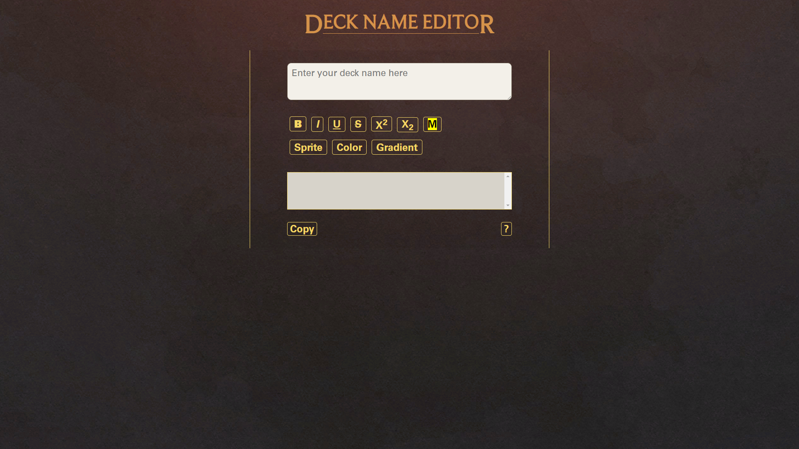
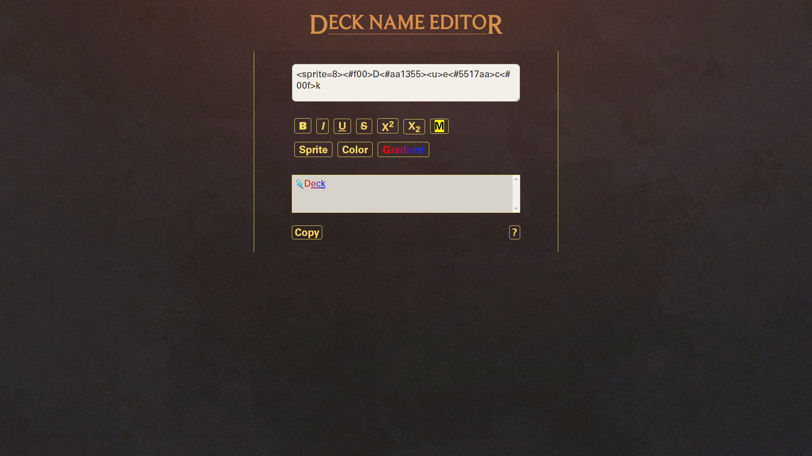

# Deck Title Generator for LoR

## Summary

A deck title generator for the game Legend of Runeterra. The application allows the user to easily insert text format, color and sprite tags. The user can preview and copy the generated title.

## Live Demo

Link: https://decknameeditor.yuncyang.com/

## Current Feature List

- Deck title generation
  - User can insert HTML text formatting tags
  - User can insert color tags
  - User can insert sprite tags
  - User can pick 2 colors and create gradient between selected texts
  - Provides warning when the title exceeds limit length
- Deck title preview
  - Automatically converts viable tags to corresponding style shown in game
- Other functions / features
  - User can easily copy the created deck title
  - Provides instructions on the helping page
  - Responsive design

## Technologies Used

- ReactJs
- TypeScript
- NodeJs
- HTML5
- CSS3
- Netlify

## Preview




## Planned Features

- Improve the interaction between color picker and modal.
- Add preview of text format on sprites.
- Improve the using of space in responsive design.
- Replace the sprites with better quality images.

## Development

### System Requirement

- NodeJs 10 or higher
- NPM 6 or higher

### Getting Started

1. Clone the repository

```
git clone https://github.com/YunCYang/lor_deck_title_generator
cd lor_deck_title_generator
```

2. Install all dependencies with NPM

```
npm install
```

3. Start the project. You can view the running application by opening http://localhost:3000 in your browser.

```
npm run build
```
